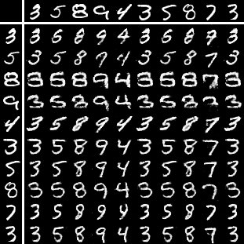
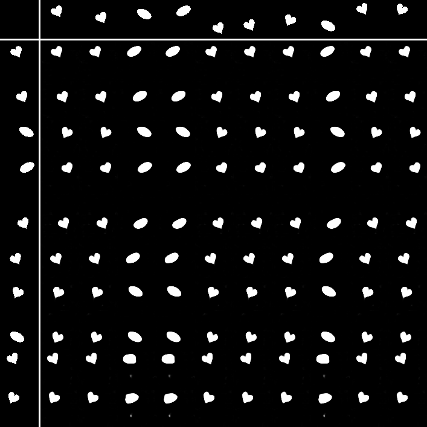

# Disentangled Information Bottleneck

PyTorch code for *"Disentangled Information Bottleneck"*.

Paper Link: [[arXiv]](https://arxiv.org/pdf/2012.07372.pdf)


## Experiments

### Hardware & Software Dependency

- **Hardware**

    We use a machine with AMD Ryzen 7 3700X CPU, 32GB RAM, and NVIDIA RTX2070S with 8GB graphics memory.

- **Software**
    
    We use Windows 10 platform with Python 3.7 and CUDA 10.1. 
    
    For all dependent libraries, please refer to ```requirements.txt```.
    
### Installation

1. Clone this repository.
    ```
    git clone https://github.com/PanZiqiAI/disentangled-information-bottleneck.git
    ```

2. Create python environment and install dependent libraries via ```pip```.
    ```
    pip install -r requirements.txt
    ```

### Training & Evaluation

#### Quantitative metrics
We compare our method to IB Lagrangian in terms of *information compression*, *generalization*, *robustness to adversarial attack*, 
and *out-of-distribution detection*. 

- Train *VIB*

    ```
    python train_lagrangian.py --model=vib --dataset=mnist --lambda_kl=0.01 --desc=quant/mnist/vib
    ```
    By running this command, a directory ```STORAGE/experiments/quant/mnist/vib``` will be created, which stores 
    training logs, evaluations on quantitative metrics, and saved checkpoints. Another directory 
    ```STORAGE/tensorboard/quant/mnist/vib``` will also be created, which stores *tensorboardX* visualization of 
    training & evaluation data. The following commands are similar. 

- Train *NIB*

    ```
    python train_lagrangian.py --model=nib --dataset=mnist --lambda_kl=0.01 --desc=quant/mnist/nib
    ```

- Train *squared-VIB*

    ```
    python train_lagrangian.py --model=vib --hfunc=pow --dataset=mnist --lambda_kl=0.001 --desc=quant/mnist/squared-vib
    ```

- Train *squared-NIB*

    ```
    python train_lagrangian.py --model=nib --hfunc=pow --dataset=mnist --lambda_kl=0.001 --desc=quant/mnist/squared-nib
    ```

- Train *DisenIB*

    ```
    python train_disenib.py --dataset=mnist --desc=quant/mnist/disenib
    ```

#### Supervised disentangling

We use convolutional models for the supervised disentangling task.

- Train on *MNIST*

    ```
    python train_disenib_mnist.py --desc=disentangling/mnist/disenib
    ```

- Train on *Shapes*

    ```
    python train_disenib_shapes.py --desc=disentangling/shapes/disenib
    ```

- Train on *Sprites*

    ```
    python train_disenib_sprites.py --desc=disentangling/sprites/disenib
    ```

## Results

### Quantitative metrics

Results on *MNIST* dataset is as follows. 

- Information compression

    Table cell entries represent ```I(X;T) / I(Y;T)```.

    | Method | *VIB* | *NIB* | *squared-VIB* | *squared-NIB* | *DisenIB* |
    | :----: | :----: | :----: | :----: | :----: | :----: |
    | Training | 3.90 / 2.23 | 2.90 / 2.20 | 3.62 / 2.22 | 2.57 / 2.13 | 2.32 / 2.30 |
    | Testing | 4.07 / 2.19 | 2.95 / 2.18 | 3.77 / 2.18 | 2.60 / 2.11 | 2.40 / 2.29 |

- Generalization

    | Method | *VIB* | *NIB* | *squared-VIB* | *squared-NIB* | *DisenIB* |
    | :----: | :----: | :----: | :----: | :----: | :----: |
    | Training | 99.79 | 97.53 | 99.52 | 95.23 | 100.0 |
    | Testing | 97.59 | 95.39 | 97.19 | 93.20 | 98.57 |

- Robustness to adversarial attack

    - Training
    
    | Method | *VIB* | *NIB* | *squared-VIB* | *squared-NIB* | *DisenIB* |
    | :----: | :----: | :----: | :----: | :----: | :----: |
    | &epsilon; = 0.1 | 76.32 | 73.59 | 68.56 | 69.21 | 97.51 |
    | &epsilon; = 0.2 | 23.76 | 30.65 | 15.86 | 31.26 | 85.25 |
    | &epsilon; = 0.3 | 5.12 | 8.59 | 2.34 | 10.81 | 72.06 |

    - Testing
    
    | Method | *VIB* | *NIB* | *squared-VIB* | *squared-NIB* | *DisenIB* |
    | :----: | :----: | :----: | :----: | :----: | :----: |
    | &epsilon; = 0.1 | 73.96 | 72.51 | 67.32 | 68.24 | 93.11 |
    | &epsilon; = 0.2 | 24.52 | 31.92 | 17.23 | 31.29 | 83.09 |
    | &epsilon; = 0.3 | 5.06 | 9.46 | 2.52 | 11.26 | 71.81 |

- Out-of-distribution detection

    We use Gaussian noise as out-of-distribution data.
    
    | Method | *VIB* | *NIB* | *squared-VIB* | *squared-NIB* | *DisenIB* |
    | :----: | :----: | :----: | :----: | :----: | :----: |
    | TPR95 | 22.81 | 29.35 | 87.93 | 43.07 | 0.00 |
    | AUROC | 95.70 | 94.97 | 55.72 | 92.60 | 99.89 |
    | AUPR In | 96.08 | 95.71 | 49.36 | 93.76 | 99.88 |
    | AUPR Out | 94.86 | 93.84 | 58.92 | 90.90 | 99.88 |
    | Detection Err | 10.22 | 11.43 | 41.69 | 14.40 | 1.39 |
    
### Supervised disentangling

- *MNIST*

<table style="width:auto">
    <tr>
        <td align="center"></td>
        <td align="center"></td>
        <td align="center"></td>
    </tr>
</table>

- *Sprites*

<table style="width:auto">
    <tr>
        <td align="center"></td>
        <td align="center"></td>
        <td align="center"></td>
    </tr>
</table>

- *Shapes*

<table style="width:auto">
    <tr>
        <td align="center"></td>
        <td align="center"></td>
        <td align="center"></td>
    </tr>
</table>
